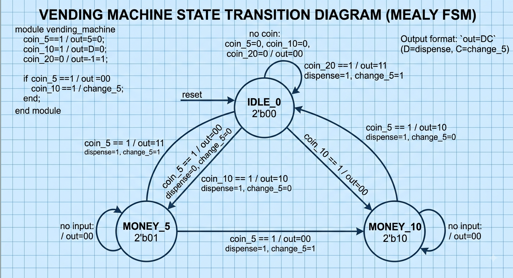
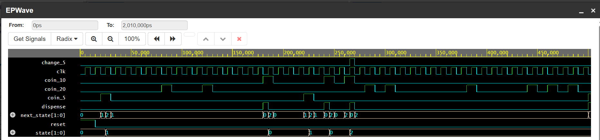

# Vending Machine — RTL Design & SystemVerilog Verification

A finite-state-machine based vending machine designed in SystemVerilog and verified using a class-based, self-checking SystemVerilog testbench.

This project covers the full RTL verification flow:

**Specification → RTL Design → FSM → Testbench → Constrained Stimulus → Monitor → Scoreboard → Functional Coverage → Assertions → Waveform Analysis**

---

## Table of Contents

- [Project Overview](#-project-overview)
- [RTL Architecture](#️-rtl-architecture)
- [Interface](#-interface)
- [State Diagram](#-state-diagram)
- [RTL Design](#-rtl-design)
- [Known Limitation](#️-known-limitation--design-scope)
- [Verification Environment](#-verification-environment)
- [Functional Coverage](#-functional-coverage)
- [Assertions](#️-assertions)
- [Verification Results](#-verification-results)
- [Waveform Analysis](#-simulation--waveform)
- [Verification Strategy](#-verification-strategy)
- [Tools Used](#️-tools-used)
- [Project Structure](#-project-structure)
- [Running Locally](#️-running-the-simulation-locally)
- [Running on EDA Playground](#-running-on-eda-playground)
- [Key Learning Outcomes](#-key-learning-outcomes)
- [Future Improvements](#-future-improvements)
- [Author](#-author)

---

## 📌 Project Overview

This project implements a vending machine with a product price of **₹15**.

The machine accepts:

- ₹5 coin
- ₹10 coin
- ₹20 coin

The design tracks the amount inserted using a finite-state machine and automatically dispenses the product (plus change, where applicable) once sufficient money is received.

### Supported transactions

| Coins Inserted | Total | Output |
|---|---:|---|
| ₹5 | ₹5 | Wait |
| ₹10 | ₹10 | Wait |
| ₹5 → ₹10 | ₹15 | Dispense |
| ₹10 → ₹5 | ₹15 | Dispense |
| ₹10 → ₹10 | ₹20 | Dispense + ₹5 change |
| ₹20 (from IDLE only) | ₹20 | Dispense + ₹5 change |

> The FSM is intentionally kept small and does **not** support arbitrary overpayment sequences such as ₹5 + ₹20. See [Known Limitation](#️-known-limitation--design-scope) below — this isn't just a documentation caveat, it's an actual gap in the current RTL.

---

## 🏗️ RTL Architecture

The vending machine is a synchronous, 3-state Mealy FSM — `dispense` and `change_5` are combinational outputs of `(current_state, coin)` and pulse for one cycle while the machine is already transitioning back to `IDLE_0`. There is no separate "dispensing" state.

```text
              coin_5          coin_5
        ┌──────────────►┌──────────────►
        │                                │
     IDLE_0 ◄──────────────────────── MONEY_10
        │      coin_5 → dispense=1 (₹15)  ▲
        │      coin_10 → dispense=1,       │
        │                change_5=1 (₹20)  │
        │                                  │
        │            coin_10               │
        └──────────────────────────────────┘
        │
        └── coin_20 (self-loop) → dispense=1, change_5=1 (₹20)
```

| State | Meaning |
|---|---|
| `IDLE_0` | No money inserted |
| `MONEY_5` | ₹5 collected |
| `MONEY_10` | ₹10 collected |

The machine returns to `IDLE_0` automatically after every successful dispense.

---

## 🔌 Interface

| Signal | Direction | Description |
|---|---|---|
| `clk` | Input | System clock |
| `reset` | Input | Asynchronous reset |
| `coin_5` | Input | ₹5 coin inserted |
| `coin_10` | Input | ₹10 coin inserted |
| `coin_20` | Input | ₹20 coin inserted |
| `dispense` | Output | Product is dispensed |
| `change_5` | Output | ₹5 change is returned |

---

## 📐 State Diagram



The diagram shows all 3 reachable states, every legal transition, and — importantly — the two self-loop transitions where a ₹20 coin arriving mid-transaction is silently dropped by the current RTL (see below).

---

## 🧠 RTL Design

The RTL is divided into three logical sections:

**1. State Register** — the current FSM state is stored in a flip-flop:
```systemverilog
always_ff @(posedge clk or posedge reset)
```
The machine resets to `IDLE_0` whenever `reset` is asserted.

**2. Next-State Logic** — combinational logic that determines the next state from the current state and the inserted coin:
```systemverilog
always_comb
```

**3. Output Logic** — Mealy outputs generated from the current state and coin input:
```systemverilog
always_comb
```

The design uses: `typedef enum`, `always_ff`, `always_comb`, synchronous FSM transitions, and combinational (Mealy) output logic.

---

## ⚠️ Known Limitation / Design Scope

This is an intentional, documented scope limit — not a bug the testbench missed:

**A ₹20 coin is only handled when inserted from `IDLE_0`.** If `coin_20` arrives while the FSM is in `MONEY_5` or `MONEY_10`, the RTL has no branch for it: `next_state` and the outputs default to "no change" — the coin is silently ignored, no dispense occurs, and the machine stays exactly where it was.

The following are **not** supported by the current FSM:

```text
₹5  + ₹20 = ₹25   → not handled
₹10 + ₹20 = ₹30   → not handled
₹20 + ₹20 = ₹40   → not handled
```

This is called out explicitly (rather than just implied by the transaction table) because the testbench's golden scoreboard model mirrors this exact behavior, and the state diagram in `docs/state_diagram.png` marks both self-loop transitions where this happens.

---

## 🧪 Verification Environment

The DUT is verified using a class-based SystemVerilog testbench with a self-checking scoreboard.

```text
                 ┌──────────────┐
                 │   Generator  │  randomizes coin_5 / coin_10 / coin_20 (0 or 1 active)
                 └──────┬───────┘
                        │ transaction
                        ▼
                 ┌──────────────┐
                 │ gen2drv Mbox │
                 └──────┬───────┘
                        ▼
                 ┌──────────────┐
                 │    Driver    │  applies coin @ negedge, holds 1 cycle, clears
                 └──────┬───────┘
                        ▼
                 ┌──────────────┐
                 │     DUT      │  vending_machine (Mealy FSM)
                 └──────┬───────┘
                        ▼
                 ┌──────────────┐
                 │   Monitor    │  samples coin + outputs @ posedge
                 └──────┬───────┘
                        │ transaction
                        ▼
                 ┌──────────────┐
                 │  Scoreboard  │  golden FSM model — compares expected vs actual
                 └──────────────┘

                 ┌──────────┐        ┌──────────┐
                 │ Coverage │        │Assertions│
                 └──────────┘        └──────────┘
```

### Transaction
```systemverilog
class transaction;
    rand bit coin_5;
    rand bit coin_10;
    rand bit coin_20;

    constraint valid_coin {
        coin_5 + coin_10 + coin_20 <= 1;
    }
endclass
```

### Generator → Driver (via mailbox)
```systemverilog
mailbox #(transaction) gen2drv;

// generator
gen2drv.put(tr);

// driver
gen2drv.get(tr);
```
The driver converts each transaction into timed DUT input signals, applying the coin at `negedge clk` and holding it for exactly one clock period so the monitor samples it cleanly at the following `posedge`.

### Monitor → Scoreboard (via mailbox)
The monitor observes the interface passively — it never drives a signal — and forwards each sampled coin event to the scoreboard.

### Scoreboard — golden reference model
Rather than a naive "sum the coins and check for ₹15/₹20" model (which would desync the first time a ₹20 arrives mid-transaction), the scoreboard implements its own copy of the DUT's exact next-state and output logic:

```systemverilog
case (exp_state)
    EXP_IDLE_0:   if (tr.coin_20) begin exp_dispense = 1; exp_change_5 = 1; end
    EXP_MONEY_5:  if (tr.coin_10) exp_dispense = 1;              // coin_20 here is ignored, matching the DUT
    EXP_MONEY_10: if (tr.coin_5)       exp_dispense = 1;
                  else if (tr.coin_10) begin exp_dispense = 1; exp_change_5 = 1; end
endcase
```

It then compares this expected output against `vif.dispense` / `vif.change_5` every cycle and reports any mismatch via `$error`.

---

## 📊 Functional Coverage

```systemverilog
covergroup vending_cg @(posedge vif.clk);
    coin_cp:     coverpoint {vif.coin_5, vif.coin_10, vif.coin_20} {
        bins no_coin = {3'b000};
        bins coin_5  = {3'b100};
        bins coin_10 = {3'b010};
        bins coin_20 = {3'b001};
    }
    dispense_cp: coverpoint vif.dispense;
    change_cp:   coverpoint vif.change_5;
endgroup
```

> **Coverage caveat:** 100% functional coverage means every defined coverage bin was exercised at least once — it is **not** proof of correctness on its own. A design could hit every bin and still produce the wrong output. What actually catches incorrect behavior is the **scoreboard** (comparing expected vs. actual on every transaction) and the **assertions** below. Coverage tells you *what was tested*; the scoreboard and assertions tell you *whether it was correct*.

---

## 🛡️ Assertions

```systemverilog
// Only one coin may be inserted at a time
assert property (@(posedge vif.clk) $onehot0({vif.coin_5, vif.coin_10, vif.coin_20}))
    else $error("Multiple coins inserted");

// Change must never be given without a dispense
assert property (@(posedge vif.clk) vif.change_5 |-> vif.dispense)
    else $error("Change without dispense");
```

---

## ✅ Verification Results

```
==============================================
           VERIFICATION RESULT
==============================================
PASS COUNT : 398
FAIL COUNT : 0
COVERAGE   : 100.00%
==============================================
```

All 398 scoreboard checks passed against the golden reference model, with 100% of defined coverage bins (all 4 coin combinations, both `dispense` states, both `change_5` states) exercised across 100 randomized transactions — including the `coin_20`-mid-transaction edge case described in [Known Limitation](#️-known-limitation--design-scope), which the golden model correctly predicts as "ignored."

---

## 📈 Simulation & Waveform

```systemverilog
$dumpfile("sim/dump.vcd");
$dumpvars(0, vending_machine_tb);
```

View with GTKWave or EDA Playground's EPWave.



### Scenarios to inspect in the waveform

| Scenario | Sequence | Expected |
|---|---|---|
| 1 | `coin_5=1` | `IDLE_0 → MONEY_5`, `dispense=0` |
| 2 | ₹5 then ₹10 | `MONEY_5 → IDLE_0`, `dispense=1`, `change_5=0` |
| 3 | ₹10 then ₹5 | `MONEY_10 → IDLE_0`, `dispense=1`, `change_5=0` |
| 4 | ₹10 then ₹10 | `MONEY_10 → IDLE_0`, `dispense=1`, `change_5=1` |
| 5 | ₹20 (from IDLE) | `IDLE_0 → IDLE_0`, `dispense=1`, `change_5=1` |
| 6 | ₹20 while in `MONEY_5`/`MONEY_10` | state unchanged, `dispense=0`, `change_5=0` (coin dropped) |

---

## 🧪 Verification Strategy

| Technique | Purpose |
|---|---|
| Directed stimulus | Test known critical scenarios |
| Constrained-random stimulus | Generate legal input combinations |
| Monitor | Observe DUT behavior passively |
| Scoreboard (golden model) | Compare expected vs. actual results every cycle |
| Functional coverage | Measure exercised input/output space |
| Assertions | Detect protocol/design violations |
| Waveform analysis | Debug temporal behavior |

---

## 🛠️ Tools Used

- SystemVerilog
- Icarus Verilog
- GTKWave
- EDA Playground
- Make
- Git / GitHub

---

## 📁 Project Structure

```text
vending-machine/
│
├── rtl/
│   └── vending_machine.sv
│
├── tb/
│   └── testbench.sv
│
├── docs/
│   ├── state_diagram.png
│   └── waveform.png
│
├── sim/
│   └── .gitkeep
│
├── Makefile
├── README.md
└── .gitignore
```

---

## ▶️ Running the Simulation Locally

**1. Clone the repository**
```bash
git clone https://github.com/YOUR_USERNAME/vending-machine.git
cd vending-machine
```

**2. Check Icarus Verilog**
```bash
iverilog -V
```

**3. Run using the Makefile**
```bash
make
```
This runs `iverilog -g2012` to compile, then `vvp` to simulate. The executable is generated inside `sim/`, and the waveform as `sim/dump.vcd`.

### Makefile commands

| Command | Action |
|---|---|
| `make` | Compile + run |
| `make compile` | Compile only |
| `make run` | Run simulation |
| `make wave` | Open waveform (requires GTKWave) |
| `make clean` | Remove generated simulation files |

---

## 🌐 Running on EDA Playground

1. Open [EDA Playground](https://www.edaplayground.com) and create a new SystemVerilog playground.
2. **Design tab** — paste `rtl/vending_machine.sv`.
3. **Testbench tab** — paste `tb/testbench.sv`.
4. **Simulator** — select **Icarus Verilog**, and ensure SystemVerilog is enabled.
5. Run the simulation, then open **EPWave** to inspect `clk`, `reset`, `coin_5`, `coin_10`, `coin_20`, `dispense`, `change_5`, `state`, and `next_state`.

---

## 🎯 Key Learning Outcomes

- Finite State Machine design (`always_ff`, `always_comb`, enumerated states)
- Mealy vs. Moore output timing
- Class-based SystemVerilog testbenches (transactions, mailboxes, virtual interfaces)
- Generator / Driver / Monitor / Scoreboard architecture
- Golden-reference-model scoreboarding (vs. naive checkers)
- Functional coverage and its limits
- SystemVerilog Assertions
- VCD waveform generation and debugging
- Icarus Verilog, Makefiles, EDA Playground, Git/GitHub workflow

---

## 🚀 Future Improvements

- Parameterized product price
- Support for arbitrary overpayment / change amounts (fixing the ₹20 mid-transaction gap)
- Additional coin denominations
- Multiple products with product selection
- Inventory tracking
- Cancel/refund operation
- Timeout handling
- More extensive constrained-random verification
- UVM-based verification environment

---

## 👤 Author

**MD Farhan Badar**
B.Tech — VLSI Design & Technology, Jamia Millia Islamia

Interested in: RTL Design · Design Verification · SystemVerilog · Computer Architecture · GPU RTL / Microarchitecture

---

## ⭐ Project Status

| Item | Status |
|---|---|
| RTL Design | ✅ Complete |
| FSM | ✅ Complete |
| SystemVerilog Testbench | ✅ Complete |
| Scoreboard (golden model) | ✅ Complete |
| Functional Coverage | ✅ Implemented (100%) |
| Assertions | ✅ Implemented |
| Waveform Analysis | ✅ Implemented |
| Makefile | ✅ Implemented |
| EDA Playground Simulation | ✅ Supported |